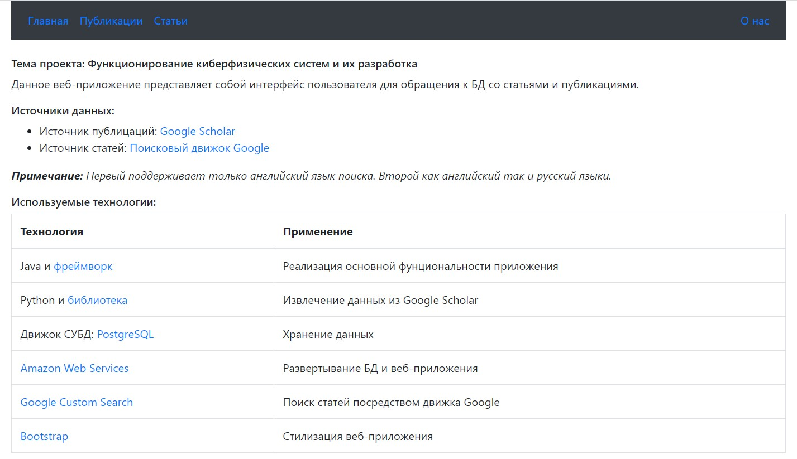
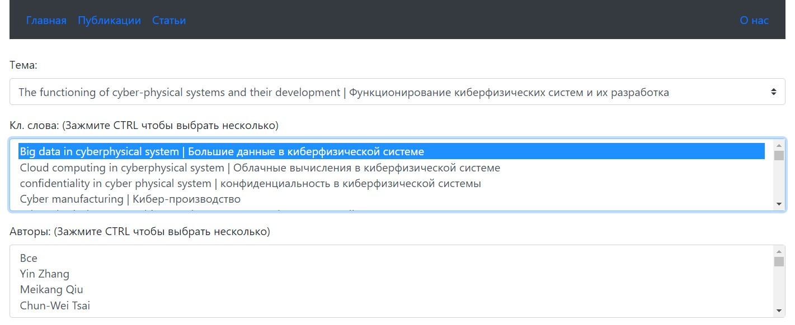
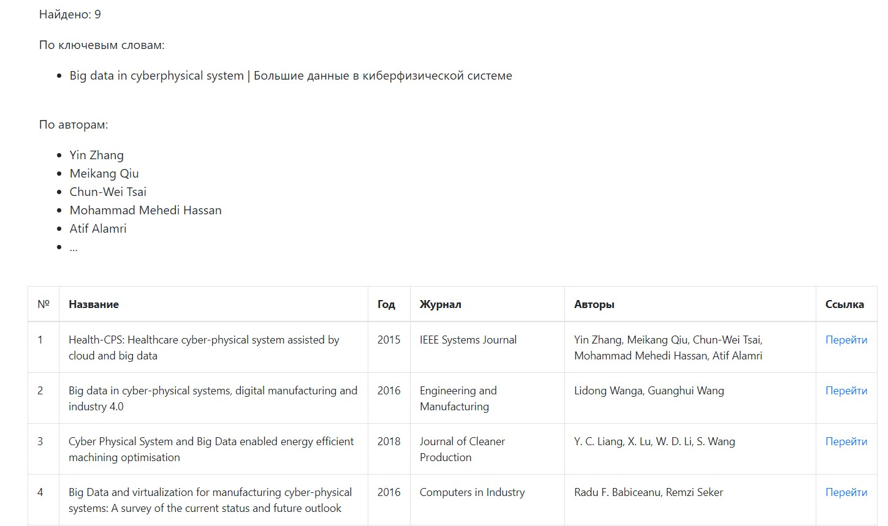
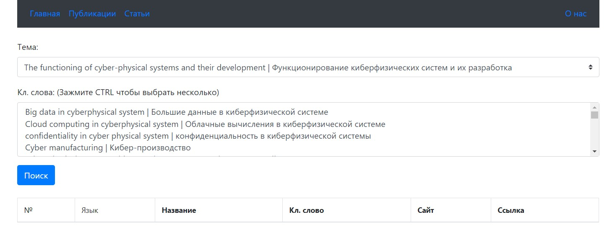
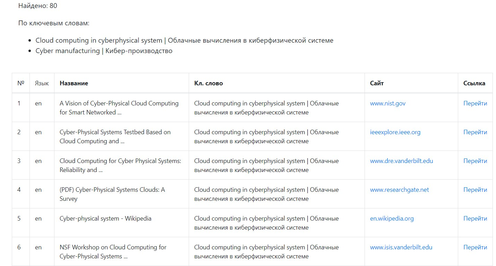

# Scrapping app

This project represents application created for two purpose:
1. Building knowledge database of articles and publications, found in Google and Google Scholar
2. Building web application for getting grabbed publications and articles 

#### Functionality:
* Getting articles (from Google) by key words
* Getting publications (from Google Scholar) by key words and authors
* Parsing Google Scholar publications <b>for study purpose only</b>, using [library](https://github.com/ckreibich/scholar.py) 
* Parsing Google web pages using [Google Custom Search](https://developers.google.com/custom-search/docs/overview?hl=ru)

#### Technogies:
* Java 14
* Spring (Boot, MVC, Data JPA)
* PostgreSQL
* AWS RDS for Cloud DB
* AWS EC2 for app deploying
* Thymeleaf for server-side templating
* Bootstrap & JQuery as Fronted technologies
* Google Custom Search for making request to Google engine

#### Images

------

------

------

------

------
